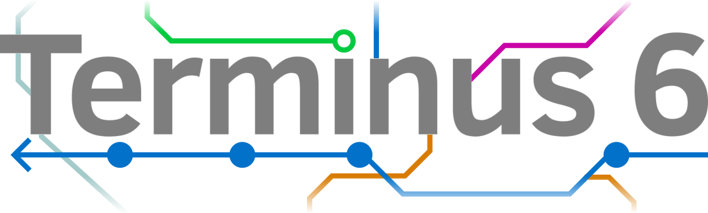
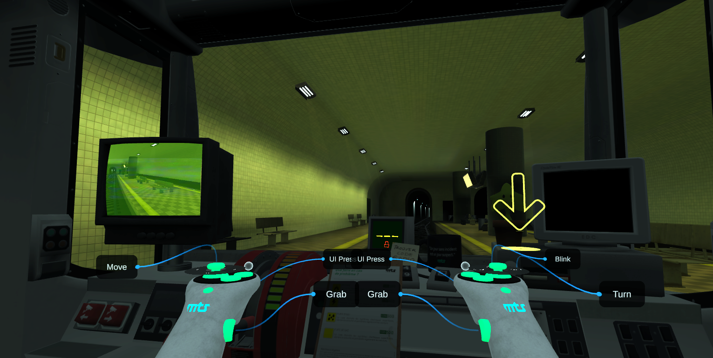

## Table of Contents
1. [Introduction](#introduction)
2. [Team](#team)
3. [Gameplay](#gameplay)
4. [Universe](#universe)
5. [Release](#release)
6. [Development](#development)
7. [Special Thanks](#special-thanks)
8. [Recommendations](#recommendations)

---

## Introduction
**Terminus 6** is a puzzle game developed by **The Terminus 6 team** during 2 months. This project was initially created as an end-of-year project for Year 3 of our Master's Degree in Digital Creation.

The development included pre-production, production and post-production phases.

---

## Team
This game was brought to life by the Terminus 6 team:
- **Bastien SANTÉ**: Product Owner, Dev
- **Maxime SOUDAY**: Scrum Master, Game Art
- **Mathis GANZ**: Game Art
- **Vincent MÉNÉROUD**: Dev

---

## Gameplay

  * [ ] ---

## Universe

 You have been hired by the transport company MTS as a night security guard. Your objective is to travel between stations, and signal any anomalies you encounter. However, your contract didn't mention that these anomalies might leave you questioning reality. 
 
---

## Release
[Provide details about the platform, availability, and installation instructions. Mention if the game is available on PC, console, or mobile, and provide links to download or install.]

This game supports Android, to be run on Android-based VR headsets.

---

## Development
This project is currently in development. Future releases will contain additional stations and graphical enhancements.
Following the discovery of a security vunlerability in Unity ([CVE-2025-59489](https://nvd.nist.gov/vuln/detail/CVE-2025-59489)), the project has been migrated to Unity version 2022.3.62f2.

If you encounter any bugs or have suggestions, please open an **[issue ticket](https://github.com/Ecole-des-Nouvelles-Images/Unity-Template/issues/new)**.

---

## Special Thanks
We would like to thank:
- **Fréderic BAST** for teaching us the C# language and Unity Engine
- **Christopher BARRERA** for discovering how to create portals on the Meta Quest 3

---

## Recommendations
For the best experience, we recommend playing with a Meta Quest 3 headset.
